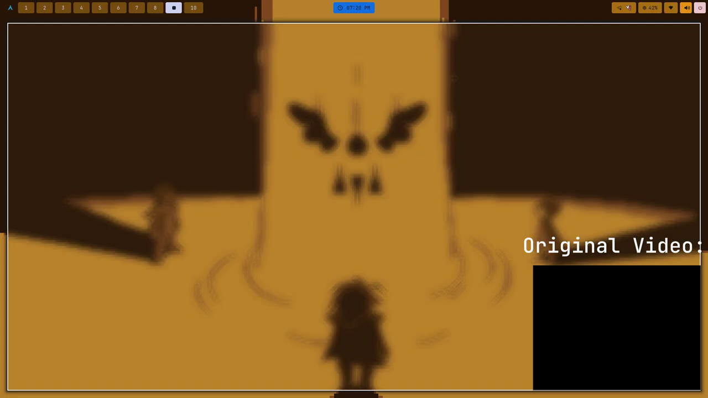

Small Video player in terminal
The bad apple video(just download it):
[](Examples/Example.mp4)

# How To install 

```console
git clone https://github.com/Stamer-programer/Video-In-Terminal.git
```
### Cd into Folder
```console
cd Video-In-Terminal
```
### Then install libraries using pip
```console
./bin/pip install -r req.txt
```
